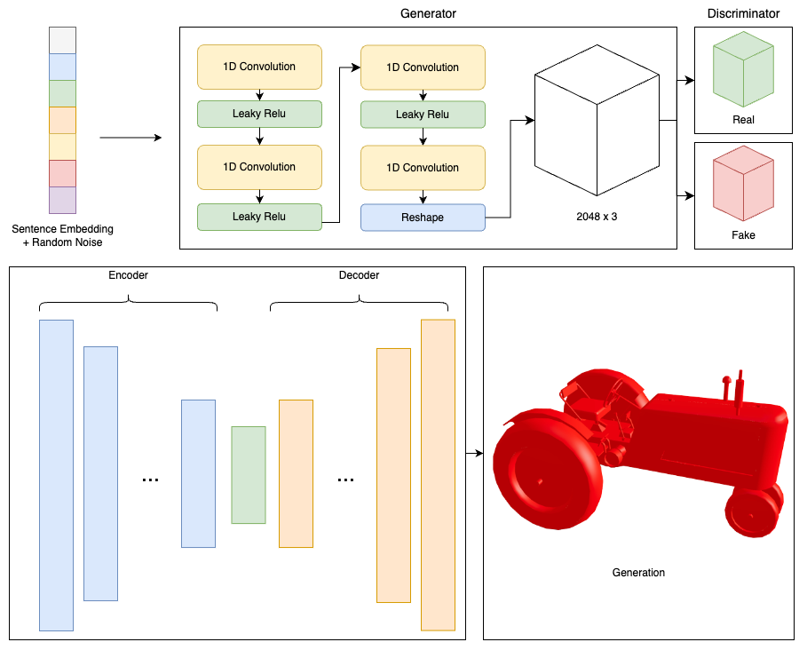

# Nervision: Text to 3D Model AI using PyTorch

## Introduction

Nervision is a Text to 3D Model AI developed by Alex Steiner for Acceleration Lab at the International School of Treviso H-FARM. The aim of this project is to generate 3D models from textual descriptions using PyTorch. 

To develop this project, I utilized a research paper created by the University of Hong Kong and Stanford University, as well as MIT. Additionally, to generate the texture, I collaborated with the amazing tool PolyHive.

## Architecture


## Requirements

To run Nervision, the following requirements must be met:

- PyTorch
- Tensorflow
- Python 3.x
- CUDA-enabled GPU (optional)
- Numpy
- Open 3D
- Trimesh
- Autocorrect
- NLTK
- Express JS
- Mongoose

## Usage

1. Clone the Nervision repository to your local machine.
2. Install the required packages 
3. Move into the WebSite folder `cd WebSite`
4. Run the program using `node server.js`
5. Input a textual description to generate a 3D model.


## Conclusion

In conclusion, Nervision is a Text to 3D Model AI developed by Alex Steiner for Acceleration Lab at the International School of Treviso H-FARM. The project aims to generate 3D models from textual descriptions using PyTorch. To generate the texture, a tool named PolyHive AI https://polyhive.ai/ is used. 

Nervision is a powerful tool for generating 3D models quickly and easily from textual descriptions. It has potential applications in various industries, including architecture, gaming, and film.

## Citation
```
 @misc{polyhive, 
    title={Polyhive, AI Auto-Texturing Tool. Generative AI software}, 
    year={2023},
    url={https://polyhive.ai/}, 
    journal={Polyhive}
} 
```
```
@article{Zhou2018,
    author    = {Qian-Yi Zhou and Jaesik Park and Vladlen Koltun},
    title     = {{Open3D}: {A} Modern Library for {3D} Data Processing},
    journal   = {arXiv:1801.09847},
    year      = {2018},
}
```
```
@misc{gulrajani2017improved,
      title={Improved Training of Wasserstein GANs}, 
      author={Ishaan Gulrajani and Faruk Ahmed and Martin Arjovsky and Vincent Dumoulin and Aaron Courville},
      year={2017},
      eprint={1704.00028},
      archivePrefix={arXiv},
      primaryClass={cs.LG}
}
```
```
@misc{shu20193d,
      title={3D Point Cloud Generative Adversarial Network Based on Tree Structured Graph Convolutions}, 
      author={Dong Wook Shu and Sung Woo Park and Junseok Kwon},
      year={2019},
      eprint={1905.06292},
      archivePrefix={arXiv},
      primaryClass={cs.CV}
}
```
```
@misc{tang2022warpinggan,
      title={WarpingGAN: Warping Multiple Uniform Priors for Adversarial 3D Point Cloud Generation}, 
      author={Yingzhi Tang and Yue Qian and Qijian Zhang and Yiming Zeng and Junhui Hou and Xuefei Zhe},
      year={2022},
      eprint={2203.12917},
      archivePrefix={arXiv},
      primaryClass={cs.CV}
}
```
```
@ARTICLE{817351,
  author={Bernardini, F. and Mittleman, J. and Rushmeier, H. and Silva, C. and Taubin, G.},
  journal={IEEE Transactions on Visualization and Computer Graphics}, 
  title={The ball-pivoting algorithm for surface reconstruction}, 
  year={1999},
  volume={5},
  number={4},
  pages={349-359},
  doi={10.1109/2945.817351}}
```
```
@misc{cer2018universal,
      title={Universal Sentence Encoder}, 
      author={Daniel Cer and Yinfei Yang and Sheng-yi Kong and Nan Hua and Nicole Limtiaco and Rhomni St. John and Noah Constant and Mario Guajardo-Cespedes and Steve Yuan and Chris Tar and Yun-Hsuan Sung and Brian Strope and Ray Kurzweil},
      year={2018},
      eprint={1803.11175},
      archivePrefix={arXiv},
      primaryClass={cs.CL}
}
```
```
@misc{ramesh2021zeroshot,
      title={Zero-Shot Text-to-Image Generation}, 
      author={Aditya Ramesh and Mikhail Pavlov and Gabriel Goh and Scott Gray and Chelsea Voss and Alec Radford and Mark Chen and Ilya Sutskever},
      year={2021},
      eprint={2102.12092},
      archivePrefix={arXiv},
      primaryClass={cs.CV}
}
```
```
@techreport{shapenet2015,
  title       = {{ShapeNet: An Information-Rich 3D Model Repository}},
  author      = {Chang, Angel X. and Funkhouser, Thomas and Guibas, Leonidas and Hanrahan, Pat and Huang, Qixing and Li, Zimo and Savarese, Silvio and Savva, Manolis and Song, Shuran and Su, Hao and Xiao, Jianxiong and Yi, Li and Yu, Fisher},
  number      = {arXiv:1512.03012 [cs.GR]},
  institution = {Stanford University --- Princeton University --- Toyota Technological Institute at Chicago},
  year        = {2015}
}
```
